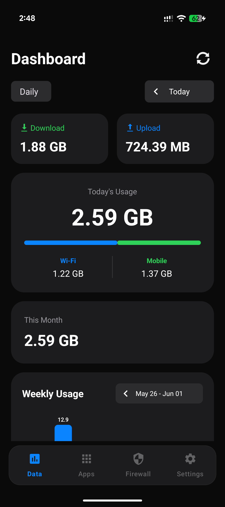
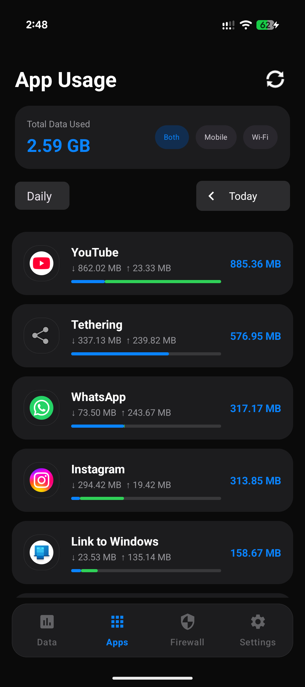
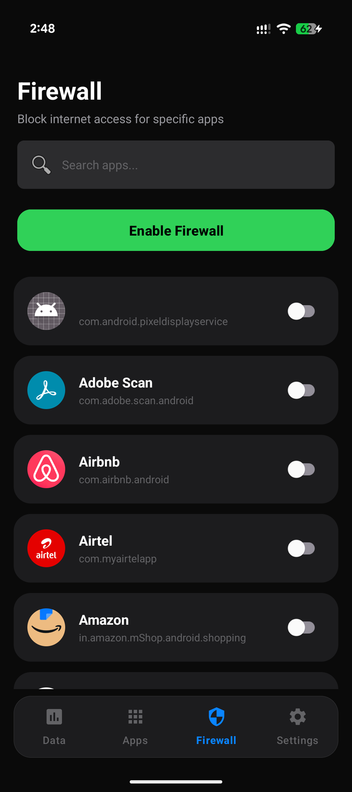
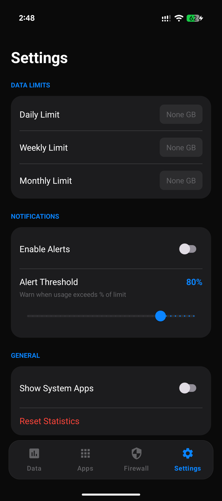

# NetPulse 📡

<div align="center">
  <h3>📊 Monitor • Analyze • Control</h3>
  <p><strong>A modern, lightweight network data tracker for Android — know exactly where your data goes</strong></p>
</div>

---

## 📱 Overview

NetPulse is a comprehensive mobile and WiFi data usage tracker built for Android that prioritizes clarity, performance, and privacy. With its sleek iOS-inspired dark interface and per-app breakdown, NetPulse puts you in full control of your data consumption — no surprises on your monthly bill.

**Why NetPulse?**
- 📊 **Crystal-Clear Insights** — See exactly which apps are eating your data
- 🎨 **Beautiful Interface** — iOS-inspired dark design with smooth animations
- ⚡ **Lightweight & Fast** — Minimal battery and memory footprint
- 🔒 **Privacy First** — All tracking happens on-device; nothing leaves your phone

---

## ✨ Features

### 📶 Data Usage Tracking
- **Per-App Breakdown** — Detailed mobile and WiFi usage for every installed app
- **Combined View** — Toggle between WiFi, Mobile, or Combined data at a glance
- **Total Usage Banner** — Prominent at-a-glance summary at the top of the dashboard
- **Real-Time Monitoring** — Live data consumption updates as you use your phone
- **Background vs. Foreground** — Distinguish usage between active and background app activity

### 🗂️ Filters & Time Ranges
- **Network Filter** — Switch between WiFi only, Mobile only, or Combined
- **Time Range Filter** — View usage by Day, Week, Month, or Year
- **App-Level Drill-Down** — Tap any app to inspect its full usage history
- **Sort & Search** — Sort apps by usage, name, or category; search instantly

### 📊 Analytics & Insights
- **Usage Charts** — Visual bar and line charts for daily/weekly/monthly trends
- **Top Data Consumers** — Quickly spot which apps use the most data
- **Data Limit Alerts** — Set thresholds and get notified before you hit your cap
- **Comparison View** — Compare usage across different time periods side by side

### 🎨 User Experience
- **Dark Theme** — Deep, elegant dark interface designed for low-light usage
- **iOS-Inspired Design** — Clean card layouts, rounded corners, and fluid transitions
- **Haptic Feedback** — Subtle tactile responses for interactions
- **Rounded App Icons** — Consistent, polished icon presentation throughout
- **Settings Page** — Customize thresholds, display preferences, and notification behavior

---

## 🛠️ Technology Stack

| Component | Technology |
|-----------|------------|
| **Language** | Kotlin |
| **UI Framework** | Material Design 3 + Custom Components |
| **Architecture** | MVVM (Model-View-ViewModel) |
| **Data Source** | Android `NetworkStatsManager` API |
| **Database** | SQLite with Room Persistence Library |
| **Charts** | MPAndroidChart |
| **Animations** | Lottie & Custom View Animations |
| **Image Loading** | Glide |
| **Min SDK** | Android 6.0 (API 23) |

---

## 📦 Installation

### Prerequisites
- Android Studio Hedgehog or later
- Android SDK 23+ (Android 6.0)
- A physical device or emulator with API level 23+

### Steps

1. **Clone the repository**
   ```bash
   git clone https://github.com/hypfridie/NetPulse-Network-Tracker.git
   ```

2. **Open in Android Studio**
   ```
   File → Open → Select the NetPulse folder
   ```

3. **Build and run**
   ```
   Run → Run 'app' (or press Shift + F10)
   ```

4. **Grant permissions**

   NetPulse requires the `PACKAGE_USAGE_STATS` permission to access network statistics. On first launch, you'll be redirected to system settings to grant this permission manually.

---

## 📱 Screenshots

<div align="center">

| Dashboard | App Usage | Firewall |
|-----------|---------------|-----------------|
|  |  |  |

| Settings |
|----------|
|  |

</div>

---

## 🏗️ Project Structure

```
NetPulse/
├── app/
│   ├── src/main/
│   │   ├── java/com/netpulse/
│   │   │   ├── activities/          # Activity classes
│   │   │   ├── adapters/            # RecyclerView adapters
│   │   │   ├── database/            # Room database components
│   │   │   ├── fragments/           # Fragment classes (Home, Stats, Settings)
│   │   │   ├── models/              # Data models (AppUsage, UsageSummary)
│   │   │   ├── receivers/           # Broadcast receivers
│   │   │   ├── services/            # Background tracking service
│   │   │   ├── utils/               # Utility & helper classes
│   │   │   └── viewmodels/          # ViewModel classes
│   │   ├── res/
│   │   │   ├── drawable/            # Vector drawables & shapes
│   │   │   ├── font/                # Custom fonts
│   │   │   ├── layout/              # XML layouts
│   │   │   ├── values/              # Colors, strings, styles
│   │   │   └── xml/                 # Preferences & configurations
│   │   └── AndroidManifest.xml
│   ├── build.gradle
│   └── proguard-rules.pro
├── gradle/
├── screenshots/                     # App screenshots
├── docs/                            # Documentation
├── LICENSE
└── README.md
```

---

## 🔒 Permissions

NetPulse uses a minimal set of permissions, only what's strictly necessary:

| Permission | Purpose |
|------------|---------|
| `PACKAGE_USAGE_STATS` | Read per-app network usage data from the system |
| `READ_PHONE_STATE` | Detect active SIM and mobile network state |
| `ACCESS_NETWORK_STATE` | Determine current connection type (WiFi / Mobile) |
| `POST_NOTIFICATIONS` | Send data limit alerts (Android 13+) |

> **No internet permission is required.** NetPulse never sends any data off your device.

---

## 🚀 Performance

- **Lazy Loading** — App entries and charts loaded on-demand
- **Database Indexing** — Optimized queries for instant search and filtering
- **Background Service** — Lightweight polling with configurable intervals
- **Memory Management** — Efficient lifecycle-aware components
- **Battery Efficient** — Uses Android's built-in `NetworkStatsManager` instead of continuous packet sniffing

---

## 🤝 Contributing

Contributions are welcome! Whether it's a bug fix, a new feature, or a UI improvement — all pull requests are appreciated.

### Areas for Contribution
- 🐛 Bug reports and fixes
- ✨ New feature suggestions or implementations
- 🌐 Translations and localization
- 🎨 UI/UX improvements
- 📖 Documentation improvements

---

## 🐛 Known Issues

- `NetworkStatsManager` data may be slightly delayed (up to a few minutes) on some OEM ROMs
- Usage statistics permission cannot be granted programmatically — manual toggle in system settings is required
- Some heavily modified Android skins (MIUI, OneUI) may report background usage differently
- Chart rendering may be sluggish on very old devices (< 2GB RAM)

---

## 🆘 Support & Help

### Getting Help
- 🐛 **Bug Reports:** ayusharyan.online@gmail.com
- 💡 **Feature Requests:** ayusharyan.online@gmail.com
- 💬 **General Questions:** ayusharyan.online@gmail.com

### FAQ

**Q: Why does NetPulse need a special permission I have to grant manually?**  
A: Android restricts access to network usage statistics for privacy reasons. The `PACKAGE_USAGE_STATS` permission must be granted manually through system settings — this is an Android requirement, not a NetPulse limitation.

**Q: Does NetPulse work without an internet connection?**  
A: Absolutely. NetPulse reads usage data directly from Android's system APIs. No internet connection or account is needed.

**Q: How accurate is the data?**  
A: NetPulse uses Android's official `NetworkStatsManager` API, which is the same source used by the built-in Data Usage screen in Android Settings. Accuracy is on par with the system itself.

**Q: Will NetPulse drain my battery?**  
A: No. NetPulse does not continuously sniff network packets. It queries the system's pre-aggregated usage stats, which is extremely lightweight.

**Q: Does NetPulse support dual-SIM devices?**  
A: Yes! NetPulse detects both SIM slots and can display per-SIM mobile data usage where supported by the device.

---

## 🌟 Show Your Support

If NetPulse has been useful to you, please consider:

- ⭐ **Star this repository** to help others discover it
- 🍴 **Fork the project** to contribute improvements
- 📢 **Share with friends** who want to track their data usage
- 💝 **Sponsor the project** to support ongoing development

---

## 📞 Contact

- **Developer:** Designed, developed, and maintained by a single independent developer.
- **Email:** ayusharyan.online@gmail.com
- **Twitter:** https://x.com/hypfridie

---

<div align="center">
  <p>Made with ❤️ for Android</p>
  <p><strong>NetPulse</strong> — Your data, your control.</p>
</div>
